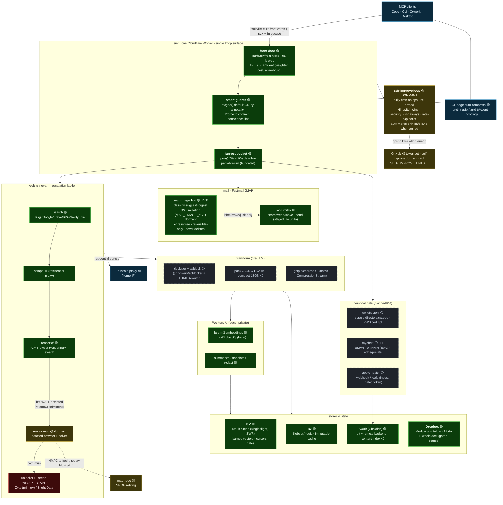

# Architecture

The shipped topology of the sux Worker — every namespace, binding, and external
dependency, colour-coded by deployment status (🟢 live · 🟡 dormant · 🔴 blocked ·
⚪ planned). The legend that decodes the status glyphs is at the bottom of the diagram.

**Legend** — 🟢 live in prod · 🟡 merged but DORMANT (needs a flag to arm) · 🔴 blocked on a secret/token · ⚪ designed/PR/planned
