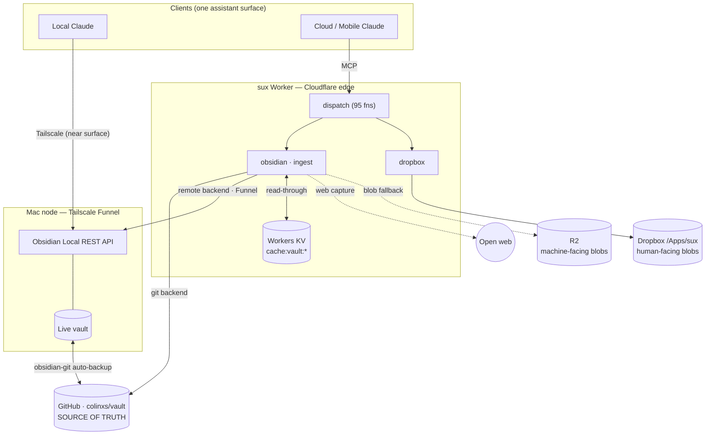
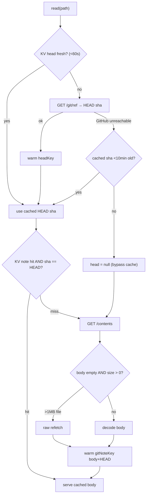
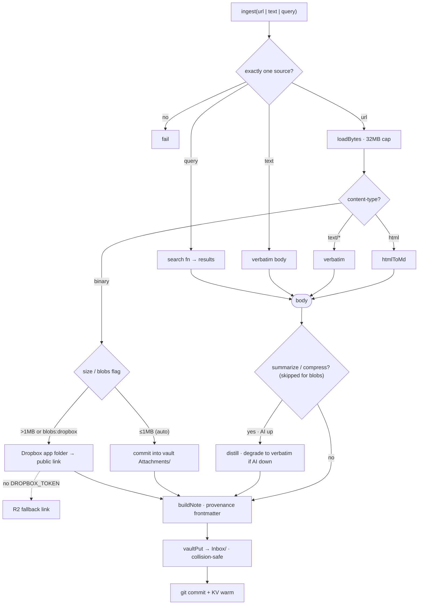
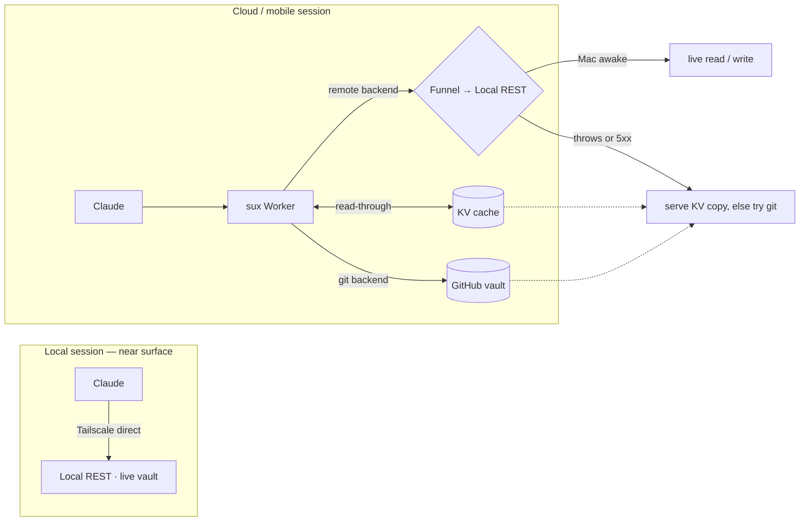

# Architecture & dataflow — the knowledge core in pictures

The visual companion to [domains.md](domains.md) (the nine-domain mapping) and [knowledge-core.md](knowledge-core.md) (the locked spec). Four diagrams, each in two forms:

- **Mermaid**, inline below — renders on GitHub and inside Obsidian, so it lives next to the prose it explains.
- **Excalidraw**, in [`diagrams/`](diagrams/) — hand-drawn style, editable. Drop a `.excalidraw` file onto [excalidraw.com](https://excalidraw.com) or open it with the Obsidian Excalidraw plugin.

| # | Diagram | Excalidraw |
|---|---|---|
| 1 | System topology — hub & spoke | [`architecture-1-topology.excalidraw`](diagrams/architecture-1-topology.excalidraw) |
| 2 | Storage read path — git = truth, KV = cache | [`architecture-2-storage-read.excalidraw`](diagrams/architecture-2-storage-read.excalidraw) |
| 3 | `ingest` dataflow | [`architecture-3-ingest.excalidraw`](diagrams/architecture-3-ingest.excalidraw) |
| 4 | Two-transport routing & degrade | [`architecture-4-transport.excalidraw`](diagrams/architecture-4-transport.excalidraw) |

---

## 1. System topology — the vault is the hub

One assistant surface reaches Colin's data estate through a handful of conduit fns on one Cloudflare Worker; the intelligence lives in skills, not in a pile of per-domain tools. Two client paths reach the same store: **local Claude** talks to the live vault directly over Tailscale (the near surface); **cloud/mobile Claude** goes through the sux Worker. GitHub (`colinxs/vault`) is the single source of truth — the live vault syncs to it via obsidian-git, and the Worker's git backend reads/writes it directly. Blobs split by audience: R2 is machine-facing, the Dropbox app folder is human-facing.

---

## 2. Storage read path — git is truth, KV is the cache

A read never trusts the cache blindly: it validates against the vault's current HEAD commit sha, rechecked with GitHub at most once a minute. A cached note is served only when its stored sha equals the live HEAD, so a cache hit is always the current file. Two failure modes are handled explicitly: when GitHub is unreachable the cached HEAD is trusted for a bounded 10 minutes then abandoned (never an unbounded stale serve), and a note over 1 MB — for which the Contents API omits the inline body — is refetched raw instead of caching an empty string. Writes (not shown) run the inverse: commit to GitHub, then warm the cache with the returned commit sha, which *is* the new HEAD.

Cache keys are namespaced by `repo@branch` (and, for notes, the in-vault path), and git vs remote entries live in separate namespaces — so a config change can't serve another vault's body under a still-valid HEAD, and a lagging git read can't clobber a fresher live-vault write-through.

---

## 3. `ingest` dataflow — capture's transport half

`ingest` auto-detects its single source and routes it to a provenance-stamped note in `Inbox/`. A URL is fetched (32 MB cap) and dispatched on content type: HTML becomes markdown, text lands verbatim, and a binary becomes an attachment — routed by size (≤1 MB commits into the vault repo; larger, or `blobs:'dropbox'`, uploads to the Dropbox app folder and the note links the public share URL, with R2 as the fallback when no Dropbox token is set). Text and query sources skip straight to a body. Optional `summarize`/`compress` passes distil the body (skipped for binaries, degrading to verbatim capture when AI is unavailable) before `buildNote` stamps the frontmatter and `vaultPut` commits it — never overwriting a default path, which is why same-day slug collisions get a time suffix.

---

## 4. Two-transport routing & degrade

The same vault is first-class from two directions. A local session reaches the Local REST API directly over Tailscale — the live vault, full ops, lowest latency. A cloud or mobile session goes through the Worker, which prefers the Funnel'd Local REST API (the remote backend) when the Mac is awake and falls back gracefully otherwise: the KV cache serves the last-known copy, and the git backend is always available as the durable floor. Crucially, the remote read falls back not only when the fetch throws (Mac asleep) but also on a 5xx from the Funnel edge (Mac awake, Obsidian closed) — the common unavailability shape.

---

*Diagrams regenerate from [`diagrams/gen_excalidraw.py`](diagrams/gen_excalidraw.py) (Excalidraw) and the fenced Mermaid blocks above (single source for the inline form). Keep both in sync when the design moves.*

## Related

- [[vault-stack]]
- [[fetch-ladder]]
- [[content-addressed-cache]]
- [[vpc-hosting]]
- [[Infrastructure-MOC]]
