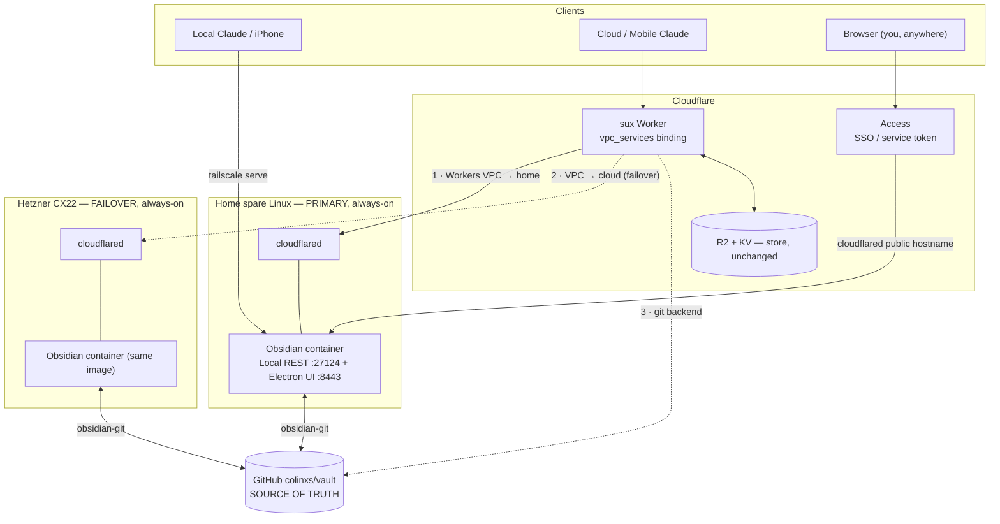
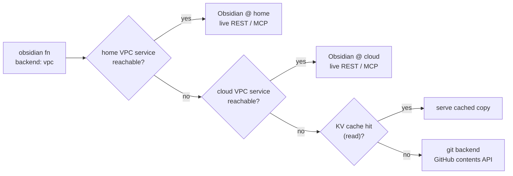

# Self-hosting the vault: home + cloud, over Cloudflare Workers VPC

> **Note — connector framing is dated (point-in-time record).** This doc adds the vault as a separate `/vault/mcp` connector (and shows `apiRoute: ["/mcp", "/vault/mcp"]`). That per-domain connector was later **retired into the single `/mcp` front door**: the `vault_*` tools ship as front-door verbs on the one `sux` connector. The `apiRoute` array still lists `/vault/mcp` (routed + OAuth-authorized for back-compat), but no plugin ships it and it is unadvertised. The VPC/hosting design here is unaffected — read `/vault/mcp` as "the vault reverse-proxy handler." Current shape: [[namespace-architecture]] / [[connector-surface-policy]].

Companion to [domains.md](domains.md) and [architecture.md](architecture.md). Answers the three "figure out" questions: (1) self-host the vault at home on a spare Linux box, (2) an always-on cloud host with an Electron web app, (3) how Cloudflare Zero Trust (`cloudflared`) maps onto Tailscale (`tailscaled`). Research-verified 2026-07-08; Colin's decisions locked inline.

## The problem this actually solves

Half the store code written this session is degrade logic for **"the Mac is asleep"** — the KV read-through cache, the remote→git fallback, the 5xx fallback. That whole problem class exists because the live vault lives on a **laptop**. Move it onto an **always-on box** and the live surface is just… always there; the fallbacks become rare-event insurance, not the common path. Second win: today the Local REST API is on a **public** Tailscale Funnel (`:8443`) where the bearer key is the only lock, and **all three** Funnel public ports (443/8443/10000) are consumed. Cloudflare Workers VPC removes both problems at once.

**Decisions (Colin, 2026-07-08):** primary = **home spare Linux box**, cloud = **failover**; Worker→vault transport = **Workers VPC (cloudflared), retire the public Funnel**.

## The three tiers (Colin, 2026-07-08)

The system settles into three tiers, each with a different job and a different availability/statefulness profile:

| Tier | What | State | Availability | Reached by |
|---|---|---|---|---|
| **1 · Store** | sux Worker (stateless fns) + **git store** | none in the Worker; git = truth, KV = cache | **always on, always correct** | claude.ai/mobile/desktop (OAuth) + the fns |
| **2 · Live MCP** | **stateful Obsidian** (Electron + plugins) on the always-on box | the running app + vault working copy | as good as the box | the Worker, privately, over **Workers VPC** |
| **3 · Client MCP** | the heavyweight Obsidian MCP surfaced to **Claude clients**, **OAuth-wrapped** | — | public-facing (clients require it) | claude.ai UI / mobile / desktop |

Tier 1 is built and deploy-ready. Tier 2 is the vpc-hosting design below. Tier 3 is the client-exposure question — §8, where the "Funnel vs Cloudflare Zero Trust" report lives.

**Sync model (revised — Sync is now *in*, alongside git):** the always-on box runs **both** fabrics. **git** (obsidian-git → `colinxs/vault`) stays the **source of truth** — the undo, the Worker's fallback backend, retrieval's exact-identifier rung. **Obsidian Sync** (native — the box runs the full app, so Sync is built in; obsidian-headless can't serve it and isn't used) is the **device-convergence layer** so the box, your Mac, and your phone's Obsidian apps stay live-synced. Complementary, not competing: git is truth + machine-readable (the Worker reads it); Sync is your-devices + E2E. The one hazard is two writers racing the same file — see §7.

---

## 1. Transport: Cloudflare Workers VPC

[Workers VPC](https://developers.cloudflare.com/workers-vpc/) (beta, **free** during beta) lets the sux Worker reach a **private** HTTP service over a `cloudflared` tunnel — no public hostname, no Funnel. It is the native answer to the question that forced the current public-Funnel design: *how does an off-tailnet Worker reach a private vault?*

- **`cloudflared`** runs on the vault box (outbound-only, zero inbound ports) and can reach `127.0.0.1:27124` (the Local REST API).
- Register that endpoint as a **VPC Service** → get a `service_id`.
- Bind it in the Worker and call it like `fetch`:

```jsonc
// wrangler.jsonc
"vpc_services": [
  { "binding": "OBSIDIAN_HOME",  "service_id": "<home-service-id>",  "remote": true },
  { "binding": "OBSIDIAN_CLOUD", "service_id": "<cloud-service-id>", "remote": true }
]
```
```bash
# on each box, after its cloudflared tunnel is up:
npx wrangler vpc service create obsidian-vault-home \
  --type http --tunnel-id <TUNNEL_ID> --hostname localhost \
  --https-port 27124 --cert-verification-mode disabled
```
```ts
// in the fn: same surface, private transport
const r = await env.OBSIDIAN_HOME.fetch("https://vault/vault/Inbox/x.md", {
  headers: { Authorization: `Bearer ${env.OBSIDIAN_REMOTE_KEY}` },
});
```

Why this is strictly better than the Funnel:

| Property | Public Funnel (today) | Workers VPC |
|---|---|---|
| Public hostname for the vault API | **yes** (bearer key = only lock) | **none** — private |
| SSRF protection | manual (the fn's guards) | **built-in** — routing is pinned to the registered host:port; the URL host only sets `Host`/SNI |
| Port ceiling | 3 total, all used | none (native binding) |
| Transport to the Worker | external `fetch` to a `ts.net` URL | `env.BINDING.fetch()` |
| Cost | free | free (beta) |

Two facts to honor: Workers VPC handles **network reachability only** — the Obsidian **bearer key still rides** as `Authorization: Bearer` (now over a private channel, never in a public URL). And the plugin's HTTP `:27123` is off by default; only HTTPS `:27124` (self-signed) is on — so target `--https-port 27124 --cert-verification-mode disabled` (or explicitly enable `:27123` in the plugin). Creating a VPC Service needs the **Connectivity Directory Admin** account role.

**Code change (one build item):** the `obsidian` fn gains a **`vpc` backend** — a peer of `remote` that calls `env.OBSIDIAN_HOME.fetch(...)` (then `OBSIDIAN_CLOUD`) instead of `fetch(OBSIDIAN_REMOTE_URL...)`. Same `/vault/`, `/search/`, `/mcp/` handling, same bearer header, same KV cache — only the transport swaps. Then `OBSIDIAN_REMOTE_URL` retires and the `:8443` Funnel is freed.

---

## 2. `cloudflared` ↔ `tailscaled` — the mapping

The one-liner: **`cloudflared` is to Cloudflare what `tailscaled` is to Tailscale** — the outbound daemon on the origin box that joins the fabric. The decisive row is the one that made the current design settle for public Funnels.

| What you want | Tailscale | Cloudflare |
|---|---|---|
| Origin daemon on the box | `tailscaled` (WireGuard mesh peer) | `cloudflared` (outbound tunnel connector) |
| **Off-fabric Worker → private service** | **impossible** — Worker is off-tailnet, must use a public Funnel | **Workers VPC** (`vpc_services` / `vpc_networks`) — private, native |
| Expose a service publicly | `tailscale funnel` — **3 ports** (443/8443/10000) | Tunnel public hostname (`vault.example.com`) — **unlimited hostnames** |
| Expose to your own devices only | `tailscale serve` (tailnet-only, injects identity) | Tunnel + **Access self-hosted app** (SSO/WARP-gated) |
| A device joins the private network | tailnet node (100.x IP, MagicDNS) | **WARP** client + device enrollment |
| Machine-to-machine auth | tailnet ACLs / node keys | Access **service tokens** (`CF-Access-Client-Id` / `-Secret`) |
| Injected identity header | `Tailscale-User-Login` | `Cf-Access-Authenticated-User-Email` / JWT |
| SSH | Tailscale SSH | Access for Infrastructure / browser SSH |
| Self-hosted control plane | **Headscale** | (managed only) |
| Relay / edge | DERP | Cloudflare edge / Argo |
| DNS | MagicDNS | Gateway / `cloudflared` resolver |
| Embed a node in an app | `tsnet` (Go) | (no equivalent — `cloudflared` is a sidecar) |

Verified nuances that matter here:

- **A Worker *can* auth to an Access-protected origin** with a service token (`CF-Access-Client-Id`/`-Secret` headers + a *Service Auth* policy). This is the public-hostname alternative to Workers VPC — useful for the human web UI, below.
- **No loopback trap:** the only same-zone `fetch` restriction is Worker→Worker on a route. A Worker→tunnel-hostname call is a normal origin subrequest and works on the same account — *just don't bind the vault hostname as one of the sux Worker's own routes.*
- **WARP is device-only.** It's the true tailnet analogue (your laptop reaching the box's private CIDR), but a Worker can't run WARP — so the Worker path *must* be Workers VPC (or public-hostname + Access token). WARP only helps *your* devices.
- **Both daemons coexist** on one box. The design runs `cloudflared` (for the Worker) and keeps `tailscale serve` (for your own devices / local Claude) side by side.

**Net:** `cloudflared` + Workers VPC for the Worker→vault data path; `tailscale serve` stays for your devices; the **public Funnel retires**. The mcp-gate's tailnet-identity tier survives; only its public secret-path tier becomes redundant.

---

## 3. The host recipe (home box and cloud, identical)

Both boxes run the **same** container. The sux `remote`/`vpc` backend's surface (`/vault/`, `/search/`, `/mcp/`) **is literally** the coddingtonbear "Local REST API (with MCP)" plugin — so any host running that plugin inside Obsidian keeps the Worker working with zero rewrite.

- **Image (with the Electron web-app "bonus"):** `linuxserver/obsidian` or `sytone/obsidian-remote` — the real Obsidian Electron app under **KasmVNC**, browser UI on `:8080`/`:8443`. Install **Local REST API** + **obsidian-git** through the browser once (they persist in `/config`). amd64 on ghcr.io; ARM64 via the Docker Hub `:arm64` tag (so a home Pi and an amd64 cloud box both work). Footprint ~300–500 MB RAM, ~2 GB image.
- **Make the REST API reachable:** set the plugin's **Binding Host** to `0.0.0.0` and publish `:27124` (the config lives in `.obsidian/plugins/obsidian-local-rest-api/data.json`; API key enforced in that mode). `cloudflared` then targets it.
- **Vault = a git checkout** of `colinxs/vault`, bind-mounted in. **obsidian-git** does two-way sync (short interval — an uncommitted Obsidian write is the *one* thing GitHub can't recover). The **notes** are a disposable cache of git-truth (wipe → re-clone), but **`.obsidian/plugins` is gitignored** — the REST key, obsidian-git config, and Sync's E2E material do NOT come back from a clone. Back up `.obsidian` (and keep Sync's E2E password recorded) if unattended recovery matters.
- **Headless alternative (cloud, no VNC):** `shanehull/obsidian-remote` runs Obsidian headless (Xvfb) with a bundled Go MCP server on `:4000` — leaner, actively maintained. It fronts `/mcp` not the raw REST paths, so publish its internal `:27124` if you want the sux REST surface too. (`obsidian-headless`, the official CLI, is **sync-only** — no REST — so it doesn't replace the plugin.)

Dropping Electron entirely (a non-Obsidian markdown MCP/REST server) is possible but **none** of those reimplement the `/vault/`+`/search/`+`/mcp/` contract — you'd retarget the Worker to its **git backend** (already built) or to a different MCP. Keeping the plugin is the zero-rewrite path.

---

## 4. Target topology



The Worker's preference order (the failover ladder — an extension of the KV/git degrade already in the code):



Editable Excalidraw of the topology: [`diagrams/vpc-topology.excalidraw`](diagrams/vpc-topology.excalidraw).

---

## 5. Cloud vendor & what moves vs stays

**Primary cloud target: Hetzner CX22** (~$4.59/mo — 2 vCPU / 4 GB / 40 GB persistent NVMe, full root) — cheapest always-on option with real disk. Run the same KasmVNC container + the obsidian-git loop; expose via `cloudflared` (Workers VPC). Alternative if you'd rather not run a tunnel daemon: **Fly.io** (~$5–14/mo + $0.15/GB volume) gives an automatic `*.fly.dev` HTTPS hostname, so the Worker could reach it over a public URL with an Access service token instead of VPC. **Not Cloudflare Containers** — GA (Apr 2026) but disk is **ephemeral** (fresh on every restart), so a filesystem vault wouldn't survive; wrong tool unless you externalize all state.

**What moves:** only the *live REST/MCP host* — off the sleeping Mac, onto the home box (+ cloud). **What stays put:** `colinxs/vault` on GitHub is still the source of truth; **R2 + KV are Worker-bound and don't move**; the Dropbox app folder stays the human blob exchange. The store question answers itself — nothing about the store relocates.

---

## 6. Build order

0. **Home box first.** Spare Linux → KasmVNC Obsidian container → install Local REST API + obsidian-git → point at a `colinxs/vault` checkout → confirm the Electron UI in a browser and the REST API on `:27124`.
1. **`cloudflared` on the home box** → named tunnel → `wrangler vpc service create obsidian-vault-home` → note the `service_id`.
2. **`vpc` backend on the `obsidian` fn** — `env.OBSIDIAN_HOME.fetch(...)`, then cache/git fallback as today; add `OBSIDIAN_CLOUD` to the ladder. Wire the `vpc_services` bindings. Deploy.
3. **Cut over + retire the Funnel** — point the Worker at `backend:vpc`, verify, then `tailscale funnel --https=8443 off` and drop `OBSIDIAN_REMOTE_URL` (keep the bearer as `OBSIDIAN_HOME_KEY`).
4. **Human web UI** — a `cloudflared` public hostname for the KasmVNC UI behind **Cloudflare Access** (SSO), so you reach the full Obsidian app from any browser.
5. **Cloud failover** — Hetzner CX22, same container, second tunnel + `obsidian-vault-cloud` VPC Service, added to the ladder.

## 7. Open items

- **Service-token rotation** (if you use the public-hostname + Access path for the web UI): tokens expire (~1 yr), a lapse silently breaks the caller — set the 1-week-out alert. Workers VPC bindings don't have this (no token).
- **Sync + git conflict safety** — three writers can now touch the same file: obsidian-git on the box, Obsidian Sync across your devices, and the Worker (git backend). Keep the **home node the single interactive-write master**; make the cloud node **pull/mirror-only** (git pull, no auto-commit); rely on Sync for device convergence and git for the machine-readable truth. An uncommitted Obsidian write is the one state neither git nor the Worker can see until it commits — keep the obsidian-git interval short.
- Vault out of iCloud on the Mac becomes moot once the live vault is the Linux box (the [iCloud-materialize gotcha](knowledge-store-live.md) disappears).

---

## 8. Tier 3 — surfacing the Obsidian MCP to Claude clients (the Funnel vs Zero Trust report)

**The ask:** the heavyweight, plugin-rich Obsidian MCP, **OAuth-wrapped** (not a raw bearer), usable as a connector in **claude.ai UI, Claude mobile, and Claude Desktop**. Two hard constraints from research (2026-07-08):

1. **Claude clients require the MCP server to be reachable over the PUBLIC internet** from Anthropic's IPs — *"servers hosted on a private network, behind a VPN, or blocked by a firewall won't connect"* ([Anthropic support](https://support.claude.com/en/articles/11175166-get-started-with-custom-connectors-using-remote-mcp)). So tier 3 is inherently a **public** exposure — Workers VPC and the tailnet (both private) **cannot** be the client path; they're only the *Worker's* path (tier 2).
2. Claude's connector supports **OAuth** (auth spec 3/26 + 6/18) across claude.ai, mobile, Desktop, Cowork ([Anthropic](https://support.claude.com/en/articles/11503834-building-custom-connectors-via-remote-mcp-servers)) — but its connector is **strict about the OAuth discovery handshake**: it needs the `WWW-Authenticate: Bearer resource_metadata="…"` header on the 401 (RFC 9728). Claude **Code** tolerates its absence by probing `.well-known/oauth-protected-resource`; **claude.ai web/mobile do not**.

### The report

| Option | OAuth? | Works in claude.ai web / mobile / desktop? | Verdict |
|---|---|---|---|
| **Tailscale Funnel** (today's mcp-gate public tier) | **No** — secret-in-URL only; claude.ai treats it as `auth: none` | secret-path works, but no OAuth, no identity, no revocation beyond rotating the secret; 3-port ceiling (full) | **Rejected** for the OAuth requirement |
| **Cloudflare Zero Trust · Access for MCP (Managed OAuth)** | Yes — Access becomes an RFC 8707 OAuth server; the origin validates the `Cf-Access-Jwt-Assertion` JWT | **Broken today for exactly these clients** — Access's 401 omits the `WWW-Authenticate` header, so claude.ai web/mobile fail at *Connect* before any login; only **Claude Code** succeeds ([anthropics/claude-ai-mcp#410](https://github.com/anthropics/claude-ai-mcp/issues/410), closed *not-planned*) | **Not yet** — right idea, wrong clients |
| **Spec-correct OAuth MCP behind a plain cloudflared tunnel** | Yes — the server implements MCP OAuth itself and emits the `WWW-Authenticate` header | **Yes** — this is the header claude.ai needs | **The working path** |

**So neither of the two you named cleanly meets the requirement**: Funnel has no OAuth at all, and CF Access Managed OAuth — the elegant, purpose-built option — is currently broken for claude.ai web/mobile/desktop connectors (the exact clients you want), working only in Claude Code, with no planned fix. The requirement is met only by an MCP server that speaks the OAuth discovery handshake correctly.

### Recommendation — route tier 3 *through the sux Worker*

The cleanest working path reuses what already works: **the sux Worker is itself an OAuth'd remote MCP server that is already a live connector in claude.ai, mobile, and Desktop** — so its OAuth discovery handshake already satisfies those clients (proven — it's the sux connector). Therefore:

- **Clients → sux Worker (its existing OAuth) → Workers VPC → the private Obsidian MCP.** The Worker federates the box's `/mcp/` tools (the `obsidian` fn already does `action=tools`/`action=call`; the richer move is to re-expose the plugin's tools as first-class connector tools).
- **Obsidian never goes public.** It stays private behind Workers VPC for *both* tier 2 and tier 3; the Obsidian bearer is only ever a **Worker secret** — that *is* "wrap the local bearer with OAuth," done by the Worker's OAuth, with zero new public surface and nothing new to secure.
- **Search comes for free** — the plugin's structured `search_query` (JsonLogic) is one of the federated tools.

**Fallback if you want a *dedicated* Obsidian connector** (separate from sux), accepting a public endpoint: run a spec-correct OAuth MCP on the box behind a plain cloudflared tunnel — [`jimprosser/obsidian-web-mcp`](https://github.com/jimprosser/obsidian-web-mcp) is purpose-built prior art (OAuth 2.0 + PKCE, cloudflared outbound-only, path-traversal-guarded, **atomic writes explicitly safe for Obsidian Sync**). It implements the handshake claude.ai needs, so it works where CF Access Managed OAuth doesn't. Trade-off: a second OAuth system to run and a public (OAuth-gated) Obsidian surface.

**Revisit CF Access Managed OAuth** once #410's `WWW-Authenticate` gap is fixed on either side — then it becomes the lowest-maintenance dedicated-connector path (Cloudflare handles the OAuth, you just validate the JWT). Track it; don't build on it yet.

---

## 9. The implementation plan (locked 2026-07-08 — all gating answers in)

**Answers baked in:** home box = x86_64, Docker-ready · CF zone exists · Obsidian Sync subscribed (box joins the existing ring) · tier-3 = second MCP endpoint on the sux Worker. Funnel/ACL fact (verified): tailnet ACLs gate which nodes may *enable* Funnel (`nodeAttrs` `funnel`), never who may *visit* — Funnel visitors are the anonymous public internet, which is why tier 3 cannot be Funnel.

> **Critique fixes folded in (2026-07-08, plan-critique workflow — 2 HIGH, 2 MED).**
> **(A0) Rotate the leaked REST key first** — it was pasted in a chat and is the only lock on the *public* `:8443` Funnel, which stays live through Phases A–B. **(B) Demote the Mac's obsidian-git the instant the box's goes live** — otherwise two auto-commit+auto-push writers on `colinxs/vault`, coupled by Sync, produce merge-conflict files that Sync replicates everywhere. **(C) Never delete `OBSIDIAN_REMOTE_KEY`** — Workers VPC gives reachability only; the bearer is still required, and home/cloud plugins mint *different* keys, so split it per box. **(D) The disk is NOT fully disposable** — `.obsidian/plugins` (the REST key, obsidian-git config) is gitignored, so a re-clone restores notes but not plugin state; back up `.obsidian` if you want unattended recovery.

### Phase A — ship tier 1 + the vault connector (no hardware; release mechanics)
0. **Rotate the Local REST API key** (leaked in chat): regenerate it in the Mac plugin, then re-sync the three consumers — `wrangler secret put OBSIDIAN_REMOTE_KEY`, the `Authorization` bearer in `~/.claude.json`, and mcp-gate's `bearerFile` (re-read per request; no restart). Do this before anything else touches the public Funnel.
1. Unlock 1Password → push `feat/obsidian-store-ops` + `docs/knowledge-core`. *(done 2026-07-08)*
2. Merge PR #28 (code) and #29 (docs). `wrangler deploy --config sux/wrangler.jsonc`.
3. `wrangler secret put DROPBOX_TOKEN` (App-folder app). Post-deploy: selftest + git-backend write→read→edit→delete round-trip + one real `ingest`. **Add `https://<worker>/vault/mcp` as a custom connector in claude.ai** — it needs only the git store, so it ships here (§8 addendum).

### Phase B — the home box (hardware; no Worker changes)
1. Docker up → `ghcr.io/sytone/obsidian-remote` (KasmVNC) with `/vaults` = a fresh `colinxs/vault` clone, `/config` persisted; `DOCKER_MODS=linuxserver/mods:universal-git`. **Change the container's default `abc/abc` basic-auth** (`CUSTOM_USER`/`PASSWORD`) before it's reachable by anything.
2. In the browser UI: install + enable **Local REST API (with MCP)** and **obsidian-git**; set REST **Binding Host = 0.0.0.0**; publish `:27124`; note the API key. Log in to **Obsidian Sync** — the box joins the Mac/iPhone ring.
3. **Atomically flip the git write-master to the box:** the moment the box's obsidian-git is auto-committing, **disable auto-commit/auto-push on the Mac's obsidian-git** (Mac becomes a Sync-only device). Exactly one git writer at all times — otherwise Sync + two committers = conflict-marker files replicated to every device.
4. `cloudflared` on the box → named tunnel (Workers VPC dashboard → Tunnels) → `npx wrangler vpc service create obsidian-vault-home --type http --tunnel-id <ID> --hostname localhost --https-port 27124 --cert-verification-mode disabled` → note `service_id`.
5. `tailscale serve` for your own devices (identity-gated, tailnet-only). Back up the box's `.obsidian` (plugin config incl. the REST key) — a bare re-clone won't restore it (finding D).

### Phase C — the `vpc` backend + cutover (code; the ultracode loop)
1. `wrangler.jsonc`: `"vpc_services": [{ "binding": "OBSIDIAN_HOME", "service_id": "…", "remote": true }]` (+ `OBSIDIAN_CLOUD` later). Registry `Env` gains the binding + a **per-box key** (`OBSIDIAN_HOME_KEY`, later `OBSIDIAN_CLOUD_KEY`) — home and cloud plugins mint different keys.
2. `obsidian` fn: `backend: "vpc"` — same runRemote surface with `remoteFetch` swapped for `env.OBSIDIAN_HOME.fetch()` (**bearer still injected — `env.OBSIDIAN_HOME_KEY`**); ladder home → (cloud) → KV fallback → suggest git. Make `vpc` the default when the binding exists. `vault_search` on the connector lights up here.
3. Implement → adversarial review workflow → fix → verify (the store-work loop). Deploy, run parallel against `remote` briefly, cut over, then `tailscale funnel --https=8443 off` and **drop `OBSIDIAN_REMOTE_URL` only** — the bearer stays a Worker secret (as `OBSIDIAN_HOME_KEY`); deleting it 401s every vpc call.

### Phase D — tier 3: the `vault` connector (code, small)
1. `apiRoute: "/mcp"` → `apiRoute: ["/mcp", "/vault/mcp"]` in the OAuthProvider config (verified: the sux Worker already uses `workers-oauth-provider` this way).
2. `/vault/mcp` handler = stateless reverse proxy: OAuth already validated by the provider → inject the Obsidian bearer → forward method/headers/body (incl. `Mcp-Session-Id`, SSE stream) to the box's `/mcp/` over `env.OBSIDIAN_HOME`. Session state lives on the box; the Worker stays stateless. Box down → 502 to the client (honest; tier 1 is the always-on surface).
3. Add `https://sux.<workers-domain>/vault/mcp` as a **new custom connector** in claude.ai — appears as its own "vault" connector (~15 tools incl. `search_query`) in web/mobile/desktop, riding the Worker's proven OAuth. Funnel stays untouched; mcp-gate public tier retires when this lands.

### Phase E — failover + web UI (independent, anytime after B)
1. Hetzner CX22 → same container, **pull/mirror-only** (git pull loop; no auto-commit; Sync optional-off) → second tunnel → `obsidian-vault-cloud` VPC service → `OBSIDIAN_CLOUD` in the ladder.
2. Web UI from anywhere: `cloudflared` public hostname on the existing zone (e.g. `vault.<zone>`) → KasmVNC `:8080`, wrapped in an **Access self-hosted app** (SSO, your identity only). This is human-browser traffic — the Access-Managed-OAuth MCP bug (#410) is irrelevant here.

**Write-master rule (3 writers exist):** the home box is the sole interactive-write master; cloud mirrors; the Worker writes via git (tier 1) or the home box's REST (tier 2) only — never to the cloud node.

### §8 addendum — decided: rolled our own (2026-07-08, built as `sux/src/vault-mcp.ts`)

Compared the prior art against keeping our Workers implementation; **rolled our own** on the Worker rather than adopting the Python service as a dependency:

| | `jimprosser/obsidian-web-mcp` (prior art) | **ours: `/vault/mcp` on the sux Worker** |
|---|---|---|
| Runtime | Python 3.12 service on the vault box | ~170 lines in the existing Worker — no new infra |
| Storage | direct files on that box (box down = connector down) | **cloud truth**: git store + KV cache — works with no box awake |
| OAuth | its own OAuth server (PKCE, DCR, password gate) to run | `workers-oauth-provider`, already proven with claude.ai (`apiRoute: ["/mcp","/vault/mcp"]`) |
| Public surface | new public hostname (cloudflared) | none new — the existing Worker URL |
| Write safety | atomic temp+rename (Sync-safe) | git commits (atomic + revertible); REST writes via Obsidian's adapter |
| Path safety | traversal/dotfile guards | `badVaultPath` (verified through the MCP surface by test) |
| Tools | 18 (incl. canvas, analytics) | v1: 9 **cloud-only** tools — read/list/write/append/edit/delete(confirm)/capture/daily×2 |
| Stolen | — | confirm-gated delete, daily-note verbs, closed schemas |

**v1 is cloud tools only** (Colin): no live-vault dependency — full-text search arrives with the tier-2 `vpc` backend; **desktop keeps the live Obsidian MCP through the local mcp-gate wrapper** meanwhile. Consequence for §9: the vault connector no longer waits for Phase B/C — it ships with **Phase A** (it needs only the git store, which is already live).

## Related

- [[vault-backends-matrix]]
- [[vault-stack]]
- [[architecture]]
- [[mcp-gate]]
- [[Infrastructure-MOC]]
